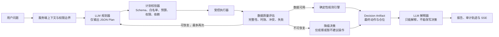

# 受约束规划型投资 Agent 升级方案

## 1. 结论与目标

本项目适合从当前的 LLM 流水线升级为**受约束的规划型 Agent**，而不适合采用可无限自主循环的通用 Agent。

目标架构为：LLM 仅在 JSON Schema、工具白名单、用户权限和调用预算内生成数据获取计划；服务端负责验证和执行计划；数据缺失、陈旧、失败或信号矛盾时，由确定性策略决定重规划或降级；评分、仓位和最终投资建议始终由规则引擎产生。

该方案的核心价值是同时获得 Agent 的适应性与金融场景所需的可控性、可审计性和可解释性。

## 2. 当前实现评估

当前系统已经具备安全升级的基础：

- `backend/app/agent/planner.py` 根据关键词和基金代码生成固定工具序列；
- `backend/app/agent/core.py` 按计划顺序执行工具，并将结果交由 LLM 总结；
- `backend/app/services/analyzer/advisor.py` 已实现确定性的评分、信号一致性检查、置信度调整和仓位建议；
- `backend/app/agent/tools/definitions.py` 已有工具描述和输入 JSON Schema；
- 执行轨迹、分析历史、会话与 SSE 进度已经存在。

但目前本质上仍是固定流水线，而非规划型 Agent：

1. 计划由关键词规则产生，LLM 不参与受约束的计划选择。
2. 工具执行结果不会改变后续计划；缺数、过期数据、工具失败和信号矛盾都不会触发重规划或降级。
3. 工具注册表目前只检查工具名称，不会强制验证参数 Schema、用户权限、调用次数或数据新鲜度。
4. 自主分析主要读取已有建议，不能确保数据刷新后重新运行规则引擎。
5. 当前提示词仍要求 LLM 给出操作建议和仓位思路，不能从机制上保证规则引擎拥有最终裁决权。
6. `compare_funds` 的默认组合及建议记录查询需要进一步核验并修复为严格按当前 `user_id` 隔离，避免静态组合或跨用户建议混用。

## 3. 总体架构



职责划分如下：

| 模块 | 职责 | 禁止事项 |
| --- | --- | --- |
| LLM 规划器 | 选择需要哪些已授权数据、以何种顺序获取 | 直接执行工具、修改建议、决定仓位 |
| 计划校验器 | 校验计划的结构、权限、依赖和预算 | 信任 LLM 的任意输出 |
| 执行器 | 受控执行已批准的工具步骤 | 根据自然语言自行扩权 |
| 数据质量评估器 | 判断数据是否足够、足够新、是否存在可恢复问题 | 将缺失数据默认为中性信号 |
| 规则引擎 | 计算评分、置信度、动作和目标仓位 | 接受 LLM 改写其结论 |
| LLM 解释器 | 用自然语言解释事实、规则结论和风险 | 生成最终动作或目标仓位 |

## 4. 不可违反的设计原则

1. LLM 不直接调用工具，也不拥有写入数据库、触发交易或修改持仓的能力。
2. LLM 只能生成满足 JSON Schema 的计划；服务端验证通过后才允许执行。
3. 所有工具都必须位于白名单内，并接受参数、用户范围、调用次数、超时和数据窗口限制。
4. 最终的 `action`、`target_position`、`confidence` 和 `decision_status` 只能由规则引擎或确定性降级策略产生。
5. 数据不足时，系统必须显式降级；不得把空值、陈旧值或失败结果当作有效的中性数据。
6. 不能为了消除信号矛盾而无限重规划；重规划只用于补齐可验证的数据。
7. 前端仅展示用户可理解的计划摘要和事实依据，不展示模型内部推理过程。
8. 所有运行都必须可追溯到计划版本、工具调用、数据时点、规则版本、质量结论和最终决策。

## 5. 计划契约

新增 `AgentPlan`、`PlanStep` 等 Pydantic 模型，并将其 JSON Schema 提供给 LLM 的结构化输出接口。

```json
{
  "version": "v1",
  "intent": "single_fund",
  "steps": [
    {
      "id": "fund_nav",
      "tool": "get_fund_nav",
      "args": {"fund_code": "008163", "days": 60},
      "depends_on": [],
      "purpose": "fund_price_history",
      "required": true
    },
    {
      "id": "technical",
      "tool": "analyze_technical",
      "args": {"data": {"$ref": "fund_nav.data"}},
      "depends_on": ["fund_nav"],
      "purpose": "technical_signal",
      "required": true
    }
  ],
  "success_profile": "single_fund_decision",
  "user_visible_reason": "需要核验近期净值、技术信号和既有规则建议"
}
```

计划校验器必须拒绝以下内容：

- 白名单之外的工具；
- 参数类型错误、未知字段、超过范围的天数或结果数量；
- 不属于当前用户的持仓、会话、建议或历史记录；
- 循环依赖、缺少依赖、引用不存在步骤或引用失败步骤；
- 超过单次运行预算的步骤、并发、重试和重规划次数；
- LLM 对任意写入型工具的直接调用。

建议初始预算：总步骤最多 10 步、单工具最多调用 2 次、最长依赖链 5 层、重规划最多 2 次。预算由服务端配置，LLM 不可覆盖。

## 6. 工具策略与权限

将每个工具定义从“名称和 Schema”扩展为 `ToolPolicy`：

```python
ToolPolicy(
    name="get_fund_nav",
    mode="read",                 # read / derived / controlled_write
    input_schema=...,
    max_calls=2,
    timeout_seconds=15,
    freshness_policy="fund_nav_t_plus_1",
    owner_scope="public_fund",
    max_days=365,
)
```

第一阶段允许 LLM 规划的工具仅包括只读和派生计算工具：

- `get_portfolio`
- `get_fund_info`
- `get_fund_nav`
- `get_market_overview`
- `get_fund_flow`
- `get_sector_trend`
- `get_latest_advice`
- `get_analysis_history`
- `compare_funds`
- `analyze_technical`

`generate_advice` 是会写入建议记录的受控动作。它不应出现在 LLM 白名单中，而应由服务端编排器在数据质量门通过且规则建议需要更新时触发。

所有查询建议记录、持仓和历史记录的工具必须显式携带并过滤 `user_id`；任何默认读取静态组合的逻辑都必须替换为当前用户的持仓查询。

## 7. 统一工具结果与数据质量

工具返回结果统一采用数据信封：

```json
{
  "status": "success",
  "data": {},
  "as_of": "2026-09-12",
  "fetched_at": "2026-09-12T16:05:00+08:00",
  "freshness_policy": "fund_nav_t_plus_1",
  "completeness": 0.95,
  "quality_flags": [],
  "error_code": null
}
```

`status` 的可选值为：

- `success`：可直接用于判断；
- `partial`：部分字段或样本缺失；
- `no_data`：无可用数据；
- `stale`：有数据但不满足时效；
- `error`：请求或执行失败。

初始数据时效策略建议如下。实际阈值必须结合交易日历、盘中/收盘状态和数据源能力配置，不能写死在业务代码中。

| 数据类型 | 完整决策的建议阈值 | 降级触发条件 |
| --- | --- | --- |
| 指数与板块快照 | 最近有效交易日 | 超过 1 个交易日 |
| 基金净值 | 最近可得净值且不超过 T+1 交易日 | 无数据或明显滞后 |
| 资金流 | 最近 1–2 个交易日 | 超过策略阈值或关键字段缺失 |
| 技术指标 | 至少 30 条有效净值 | 样本不足、异常比例过高 |
| 规则建议 | 输入数据快照未变化且未过期 | 数据更新后尚未重算 |

质量评估器应输出：`READY`、`REPLAN`、`DEGRADED` 或 `BLOCKED`，并包含缺失数据、陈旧数据、失败步骤和冲突证据。

## 8. 重规划与降级状态机

执行过程：

1. LLM 根据受限上下文生成初始计划。
2. 服务端验证计划，执行通过验证的步骤；依赖失败时跳过下游步骤。
3. 数据质量评估器检查完整性、时效性、依赖状态和信号冲突。
4. 若存在可恢复问题，并且未超出重规划预算，向 LLM 提供经过脱敏和压缩的质量报告，让它仅追加可恢复数据步骤。
5. 若数据已满足规则引擎输入要求，调用规则引擎。
6. 若数据无法恢复或预算耗尽，生成确定性的降级决策。
7. LLM 基于事实与最终决策生成解释文本。

允许重规划的例子：

- 单只基金的净值数据少于 30 条，可请求更长但仍在上限内的窗口；
- 市场快照陈旧，可请求受控的数据刷新或读取更新后的快照；
- 某个可选信号失败，可补充另一项已授权的辅助数据。

不允许重规划的例子：

- 反复尝试直到获得“看多”或“看空”的一致信号；
- 请求白名单外数据源；
- 通过扩大查询范围绕过用户数据范围；
- 在数据已足够但规则结论不符合预期时继续调用工具。

信号冲突的处理原则：若冲突来自缺数、陈旧或质量不足，可补齐关键数据一次；若各维度均有效但仍冲突，必须由规则引擎输出保守结论并降低置信度，不再无限重试。

## 9. 最终决策契约

新增不可变的 `DecisionArtifact`，作为规则引擎和前端之间的唯一决策来源：

```json
{
  "status": "ready",
  "action": "持有观望",
  "target_position": 0.3,
  "confidence": 62.0,
  "consistency": "低（信号矛盾）",
  "rule_version": "advisor-v2",
  "data_snapshot_id": "snapshot-id",
  "blocking_reasons": [],
  "evidence_ids": ["market-1", "fund-nav-1"]
}
```

决策状态定义：

| 状态 | 含义 | 是否允许输出目标仓位 |
| --- | --- | --- |
| `ready` | 数据完整且新鲜，规则引擎成功计算 | 是 |
| `degraded` | 信息不完整、陈旧或存在不可消除的关键不确定性 | 否 |
| `blocked` | 无法可靠分析，例如关键数据完全不可用 | 否 |

在 `degraded` 或 `blocked` 状态下，动作只能是“暂不建议操作”或“持有观察”，并明确显示缺失项和恢复判断所需条件。

现有 `Advisor` 在调用前应增加输入有效性门禁。不能再把空资金流、空估值数据或缺失市场数据自动折算为中性维度后继续计算评分。

LLM 解释器只接收：数据事实、质量报告、规则输出和风险提示。提示词中应删除“由 LLM 给出最终操作建议和仓位”的要求；前端应将 `DecisionArtifact` 作为独立只读卡片渲染，而不是从自然语言文本提取建议。

## 10. 代码改造清单

### 新增模块

- `backend/app/agent/contracts.py`：`AgentPlan`、`PlanStep`、`ToolResultEnvelope`、`QualityReport`、`DecisionArtifact`。
- `backend/app/agent/policy.py`：工具白名单、参数限制、权限范围、调用预算和时效策略。
- `backend/app/agent/plan_provider.py`：LLM 结构化 JSON 规划适配层。
- `backend/app/agent/plan_validator.py`：计划结构、依赖、Schema、权限和预算校验。
- `backend/app/agent/execution_engine.py`：依赖图执行、超时、重试、预算和步骤状态控制。
- `backend/app/agent/quality_gate.py`：完整性、时效、失败和冲突判定。
- `backend/app/services/decision_service.py`：构建数据快照，调用规则引擎，生成 `DecisionArtifact`。
- `backend/app/models/agent_run.py`：运行、计划、步骤、质量结论、重规划和数据快照审计模型。
- 对应 Alembic migration。

### 调整模块

- `backend/app/agent/planner.py`：保留为 LLM 规划失败时的确定性兜底计划器。
- `backend/app/agent/core.py`：拆分为规划、验证、执行、质量评估、规则决策和解释，不再作为自由工具循环入口。
- `backend/app/agent/tools/registry.py`：在执行前强制参数 JSON Schema、权限和预算验证。
- `backend/app/agent/tools/executor.py`：所有工具改为返回统一数据信封，并补齐数据时点与质量信息。
- `backend/app/agent/service.py`：负责整个状态机，确保“数据刷新 → 规则重算 → LLM 解释”的顺序。
- `backend/app/agent/prompts/agent.yaml`：调整为“解释规则决策、描述事实和风险”，移除 LLM 决定仓位的职责。
- `backend/app/agent/tools/executor.py` 中的 `compare_funds`：确保默认组合和所有建议记录查询都严格按当前用户隔离。
- `frontend/src/views/AgentSettings.vue`：增加计划摘要、数据时点、重规划/降级原因、规则版本和最终决策卡片。

## 11. 审计、可观测性与前端事件

建议新增 `agent_runs` 与 `agent_run_steps`，或扩展既有 `agent_analysis`，持久化：

- 用户、会话、问题摘要；
- 计划 JSON、计划 Schema 版本和提示词版本；
- 每一步的工具、参数摘要、开始/结束时间、状态、数据时点和错误码；
- 每轮重规划的触发原因及质量报告；
- 数据快照标识、规则版本和 `DecisionArtifact`；
- Provider、模型、令牌消耗、耗时和降级状态。

SSE 建议增加以下事件，但不暴露思维链：

```text
plan_validated
tool_started
tool_completed
quality_checked
replan_requested
decision_ready
degraded
summarizing
complete
error
```

前端可展示“正在读取市场数据”“净值数据过期，正在补充数据”“数据不足，已降级为观察结论”等用户可理解状态，以及工具时点和规则版本。

## 12. 分阶段实施

### 阶段 0：安全与基础修复

1. 修复 `compare_funds` 的用户隔离与静态组合回退问题。
2. 为现有工具接入运行时参数校验、范围限制、超时和统一错误码。
3. 将工具结果改为统一数据信封。
4. 为数据时效和质量字段建立最小可用策略。

### 阶段 1：规则引擎裁决边界

1. 增加输入有效性门禁，避免缺失数据被误判为中性。
2. 引入 `DecisionArtifact` 与 `ready / degraded / blocked` 状态。
3. 让前端的最终动作与仓位只读取规则产物。
4. 改写提示词，使 LLM 仅解释而不裁决。

### 阶段 2：受约束的 LLM 规划

1. 实现计划 Schema、计划提供器和校验器。
2. 以只读工具白名单启动灰度。
3. 保留现有确定性规划器作为 JSON 失败、校验失败或 Provider 不可用时的兜底。
4. 将旧的自由工具调用循环标记为废弃，不向服务层暴露。

### 阶段 3：受限重规划与降级

1. 实现质量评估器和最多两轮重规划。
2. 仅允许针对缺失、陈旧或可恢复失败补充步骤。
3. 实现预算耗尽和不可恢复时的确定性降级。
4. 在收盘后自主分析中落实“刷新有效数据、重算规则、再解释”的顺序。

### 阶段 4：审计、体验与灰度

1. 增加运行和步骤审计表。
2. 补齐 SSE 事件和前端透明度展示。
3. 通过特性开关同时运行旧计划与新计划。
4. 比较完成率、成本、延迟、降级率、规则建议一致性和人工抽检结果后切换默认路径。

## 13. 测试与验收标准

新增测试至少覆盖：

1. 非白名单工具、未知字段、类型错误、超范围参数和循环依赖计划均被拒绝。
2. 用户不能读取其他用户的持仓、建议、历史或会话数据。
3. 数据不足、陈旧、部分成功、依赖失败和工具超时会进入预期状态。
4. 质量问题可恢复时最多重规划两轮，且仅调用允许的补救工具。
5. 有效信号矛盾时规则引擎输出保守结果，不进入无限循环。
6. `degraded` 与 `blocked` 状态永远不会输出目标仓位。
7. LLM 规划失败、返回无效 JSON 或 Provider 不可用时，会使用固定计划或安全降级。
8. LLM 解释文本不能覆盖 `DecisionArtifact`；前端最终决策只来自规则结果。
9. 每次运行都能回放计划、工具状态、数据时点、重规划原因和规则版本。

上线验收指标建议：

- 计划 Schema 校验拒绝率、工具失败率、重规划率和降级率可观测；
- 运行无越权数据访问；
- 所有最终仓位与动作均能追溯到规则版本和数据快照；
- 在灰度样本中，新路径的成功率不低于旧路径，且无无限循环或成本失控；
- 人工抽检中，LLM 的解释与规则结论、实际数据没有矛盾。

## 14. 最终建议

不要把当前固定流程直接替换为自由 Agent。应将系统演进为“LLM 受限规划 + 服务端确定性执行 + 数据质量门控重规划 + 规则引擎裁决 + LLM 解释”的金融决策系统。

这样既能解决固定关键词计划覆盖面有限的问题，又不会把数据访问、仓位判断和投资建议的最终控制权交给概率模型。

## 15. 实施记录

第一轮实现已完成以下内容：

- 新增受约束计划、工具结果、质量报告和最终决策的数据契约；
- 通过工具策略、运行时 Schema 校验、参数范围和只读白名单约束工具调用；
- 修复 `compare_funds`：默认使用当前用户持仓，建议记录查询始终按 `user_id` 隔离；
- 新增依赖感知的执行引擎、数据质量门、最多两轮的质量触发重规划，以及确定性兜底计划；
- 单基金场景中，规则引擎的动作、目标仓位和置信度会封装为 `DecisionArtifact`，LLM 只能解释；
- 将完整的规则建议结果持久化，避免从自然语言建议文本反推目标仓位；
- Agent SSE 现在包含计划校验、工具进度、质量检查、重规划和规则决策事件；
- 前端展示规则决策卡片，并提供 `CONSTRAINED_AGENT_ENABLED` 灰度开关。

在接入新的外部数据源、交易日历或组合级规则引擎前，应继续沿用本方案中的白名单、质量门和规则裁决边界。
